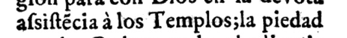
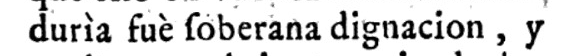

# Dataset Construction

This folder contains the scripts used to construct the OCR training dataset used in this project. The dataset is built from historical PDF documents and their corresponding transcriptions stored in `.docx` files.

The process combines automated extraction (segmentation, OCR, alignment) with manual verification and filtering. The full pipeline was made for the original data format provided by the organization, but may be useful for other sources with some adaptation. 

---

# Overview of the Pipeline

The dataset is constructed in the following stages:

1. Render PDF pages into images  
2. Automatically construct a preliminary dataset using line segmentation and OCR  
3. Preprocess the extracted line images  
4. Manually review samples and remove incorrect ones  
5. Remove incomplete annotations.  
6. Normalize punctuation
7. Filter the dataset to keep only Spanish sentences
8. Remove accents from the labels


## 1. Render PDF Pages

The first step converts PDF documents into raster images so that line segmentation and OCR models can operate on them.

Script used:

```
scripts/render_pdf.py
```

Each page of each PDF is rendered as a PNG image using **PyMuPDF**.

Example output structure:

```
data/pages/
  document_1/
    1.png
    2.png
    3.png
  document_2/
    1.png
    2.png
```

Pages are rendered at high resolution (default **400 DPI**).


## 2. Automatic Dataset Construction

Once the page images are generated, an automatic pipeline constructs an initial dataset.

Script used:

```
scripts/construct_dataset.py
```

This script performs the following steps:

### 1. Line segmentation

Each page image is segmented into individual text lines using **Kraken**.

### 2. Line cropping

Detected lines are cropped from the page image and saved as individual images.

### 3. Initial OCR prediction

Each cropped line is processed with **Tesseract OCR** to obtain a preliminary transcription.

### 4. Ground-truth extraction

The corresponding transcription is extracted from `.docx` files that contain the annotated text of the document.

The script parses page markers such as:

```
PDF p1
PDF p2
PDF p3
```

to associate transcription lines with the correct page.

### OCR–GT alignment

OCR predictions are aligned with ground-truth lines using a **sequence alignment algorithm** based on string similarity.

This produces pairs:

```
(line_image, gt_text)
```

along with a similarity score.

### Dataset output

Accepted matches are written to:

```
dataset.csv
```

Each row contains metadata such as:

- PDF identifier
- page number
- cropped image path
- ground-truth text
- OCR text
- similarity score
- bounding box coordinates

Unassigned OCR lines or unmatched ground-truth lines are stored separately for inspection.


## 3. Image Preprocessing

After dataset construction, all cropped line images are preprocessed to standardize their appearance.

Script used:

```
scripts/preprocess_images.py
```

Preprocessing steps include:

- conversion to grayscale
- contrast normalization using percentile clipping
- optional gamma correction
- resizing to a fixed height (default **32 pixels**)

This ensures the images have consistent contrast and scale before training.


## 4. Manual Dataset Review

Even with automatic alignment, some samples contain incorrect labels or segmentation errors.

To correct these cases, a manual review tool is used.

Script used:

```
scripts/review_dataset.py
```

This script launches a graphical interface where each sample can be inspected.

For each line image, the reviewer can:

- keep the sample
- remove the sample
- edit the ground-truth text
- crop the image if segmentation is slightly incorrect
- replace the image if necessary

Samples with incorrect labels are removed from the dataset. The script is run twice:

1. First, samples are displayed in increasing order of matching confidence score. Incorrect pairings are removed until the samples begin to look consistently correct.

2. Then, samples are displayed in decreasing order of ground-truth label length. In some cases, document parsing fails to distinguish separate lines and merges consecutive lines into a single one. This produces incorrect ground-truth labels.


## 5. Remove Incomplete Annotations

Some samples contain ellipses such as:

```
...
…
```

These typically correspond to incomplete or uncertain annotations in the source transcription.

All samples containing these markers are removed from the dataset.


## 6. Normalize Punctuation

Different hyphen characters are normalized so that punctuation is consistent across the dataset.

For example:

```
–  →  -
```

This prevents the model from learning inconsistent punctuation variants.


## 7. Language Filtering

Finally, the dataset is filtered to keep only **Spanish sentences**.

Script used:

```
scripts/keep_spanish.py
```

Language detection is performed using a pretrained **FastText language identification model (`lid.176.bin`)**.

The script predicts the language of each ground-truth string and keeps only rows where the predicted language is Spanish (`es`), removing al Latin samples.

## 8. Removing Accents

When defining the character set for the OCR model, a deliberate design decision was made to remove all accents from vowels, while preserving the characters `ñ` and `Ñ`. This choice is motivated by both linguistic and practical considerations.

From a corpus analysis perspective, the original annotations indicate that accent usage in the source documents is often inconsistent, so they don't add much infomation. 

From a modeling standpoint, retaining accented vowels would increase the vocabulary size by ten additional symbols (one for each accented vowel in both lowercase and uppercase), thereby increasing the complexity of the recognition task. Given the limited size of the dataset and the observed variability in accent usage, this added complexity is not justified by a proportional gain in transcription quality.

Therefore, all accented vowels are systematically normalized to their unaccented counterparts (e.g., `á → a`, `É → E`), while `ñ` and `Ñ` are preserved. This normalization reduces label noise and simplifies the output space.

The preprocessing step is implemented using the following script:

```
scripts/remove_accents.py
```

## Final Dataset

After all processing and filtering steps, the resulting dataset contains:

- cropped line images
- verified ground-truth transcriptions
- normalized punctuation
- Spanish text only
- manually validated samples

The final dataset can then be used to train OCR models on historical Spanish documents.

---

# Remaining Annotation Inconsistencies

Despite the automated pipeline and manual filtering steps, a small number of inconsistencies remain that could not be reliably detected automatically. Fully cleaning these cases would require additional manual inspection, which would be excessively time-consuming.

For instance, some documents follow grammatical conventions that differ from modern Spanish. In many cases, the transcribers corrected these forms instead of reproducing the observed text exactly as it appears in the source. Because these conventions vary across documents, this may introduce inconsistencies in the dataset.

A typical example concerns the historical use of the letter *f*, which in some texts corresponds to the modern letter *s*. In some cases, the transcriber preserves the original letter *f*, while in others it is normalized to *s*. As a result, the same visual character in the image may correspond to different ground-truth labels across samples. This inconsistency may make it harder for the model to reliably distinguish between these two letters.

<figure>
  
  <figcaption style="text-align:center;">
    GT label: assistencia a los Templos; la piedad
  </figcaption>
</figure>

<figure>
  
  <figcaption style="text-align:center;">
    GT label: duria fue soberana dignacion, y
  </figcaption>
</figure>

---

# External Tools

The pipeline requires several external tools installed on the system.

## Kraken

Kraken is used for **line segmentation** of historical page images.

Official documentation:  [Kraken](https://kraken.re/)


## Tesseract OCR

Tesseract is used to generate **preliminary OCR predictions** during dataset construction.  
These predictions are aligned with the ground-truth transcription to automatically construct the training dataset.

Official documentation: [Tesseract](https://tesseract-ocr.github.io/tessdoc/)


## FastText Language Identification Model

The language filtering step uses the **FastText language identification model**.

Download the pretrained model: [FastText](https://fasttext.cc/docs/en/language-identification.html)

Place the downloaded `lid.176.bin` file in the project directory or update the path in `keep_spanish.py`.

---
# References

[1] Joulin, A., Grave, E., Bojanowski, P., & Mikolov, T. (2016).  
**Bag of Tricks for Efficient Text Classification.**  

[2] Joulin, A., Grave, E., Bojanowski, P., Douze, M., Jégou, H., & Mikolov, T. (2016).  
**FastText.zip: Compressing text classification models.**  
